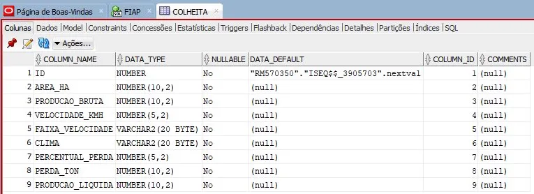

# FIAP - Faculdade de Informática e Administração Paulista

<p align="center">
<a href= "https://www.fiap.com.br/"></a>
</p>

<br>

# FarmTech Solutions — Monitoramento de Perdas na Colheita de Cana-de-Açúcar

## FarmTech Solutions

## 👨‍🎓 Integrantes: 
- David Lacerda (RM570350)
- Renata de Almeida Marinho (RM569342)
- Giselli Mayumi Takahashi Yokoyama (RM572690)
- Richard Wrobel dos Santos (RM573998)

## 👩‍🏫 Professores:
### Tutor(a) 
- Nicolly Candida Rodrigues de Souza
### Coordenador(a)
- André Godoi Chiovato


## 📜 Descrição

O Brasil é líder mundial na produção de cana-de-açúcar, com safras superiores a 620 milhões de toneladas por ano. No entanto, a colheita mecanizada — hoje predominante no setor — gera perdas que podem chegar a 15% da produção, segundo a SOCICANA (Associação dos Plantadores de Cana da Região de Guariba). Em comparação, a colheita manual raramente ultrapassa 5% de perda. Considerando o estado de São Paulo, com aproximadamente 3 milhões de hectares plantados e produtividade média de 100 t/ha, esse percentual representa prejuízos anuais na casa de R$ 20 milhões para o setor.

Este projeto propõe uma solução em Python para o registro, análise e acompanhamento de perdas na colheita mecanizada de cana-de-açúcar. A aplicação permite ao produtor cadastrar colheitas informando área (ha), produção estimada (ton), velocidade da colhedora (km/h) e clima durante a operação. A partir desses dados, o sistema calcula automaticamente a perda estimada usando uma tabela de memória baseada em Santos et al. (2014), classifica o nível de perda segundo critérios SOCICANA (BAIXO ≤ 3%, MÉDIO ≤ 4,5%, ALTO > 4,5%) e gera recomendações operacionais específicas para cada cenário.

A solução é estruturada em quatro módulos Python: `colheitas.py` (lógica de cálculo, validação de inputs e recomendações), `arquivo.py` (persistência em JSON e exportação de relatório TXT), `banco.py` (integração com Oracle Database) e `main.py` (menu interativo). Os dados são persistidos simultaneamente em JSON local e no Oracle, garantindo redundância e permitindo análise histórica. O usuário pode ainda exportar relatórios completos em TXT com a média geral de perdas no período.

A aplicação emprega os conceitos estudados nos capítulos 3 a 6 da disciplina: subalgoritmos com passagem de parâmetros, estruturas de dados (lista, tupla, dicionário, tabela de memória), manipulação de arquivos (texto e JSON) e conexão com banco de dados Oracle. A validação de entrada impede que dados indesejados corrompam o histórico, e a saída via prompt foi desenhada com foco em clareza e usabilidade.

O diferencial do projeto está na fundamentação científica dos percentuais de perda (não são valores arbitrários, mas baseados em estudos reais) e na geração automática de recomendações contextuais — o sistema não apenas calcula, mas orienta o produtor sobre como reduzir as perdas em cada situação operacional.


## 📁 Estrutura de pastas

Dentre os arquivos e pastas presentes na raiz do projeto, definem-se:

- <b>assets</b>: aqui estão os arquivos relacionados a elementos não-estruturados deste repositório, como imagens (logo FIAP, estrutura da tabela Oracle).

- <b>src</b>: Todo o código fonte do projeto (`colheitas.py`, `arquivo.py`, `banco.py`, `main.py`).

- <b>README.md</b>: arquivo que serve como guia e explicação geral sobre o projeto (o mesmo que você está lendo agora).

## 🔧 Como executar o código


### Pré-requisitos

- Python 3.10 ou superior
- Biblioteca `oracledb`:

```
pip install oracledb
```

- Acesso ao Oracle Database (FIAP ou instância local).

### Passo a passo

**1. Clone o repositório:**

```
git clone https://github.com/SEU-USUARIO/NOME-DO-REPO.git
cd NOME-DO-REPO
```

**2. Crie a tabela no Oracle:**

Antes da primeira execução, crie a tabela `colheita` no seu schema Oracle com a seguinte estrutura:



Script SQL equivalente:

```sql
CREATE TABLE colheita (
    id NUMBER GENERATED ALWAYS AS IDENTITY PRIMARY KEY,
    area_ha NUMBER(10,2) NOT NULL,
    producao_bruta NUMBER(10,2) NOT NULL,
    velocidade_kmh NUMBER(5,2) NOT NULL,
    faixa_velocidade VARCHAR2(20) NOT NULL,
    clima VARCHAR2(20) NOT NULL,
    percentual_perda NUMBER(5,2) NOT NULL,
    perda_ton NUMBER(10,2) NOT NULL,
    producao_liquida NUMBER(10,2) NOT NULL
);
```

**3. Configure as credenciais:**

Abra `src/banco.py` e substitua os placeholders pelas suas credenciais do Oracle:

```python
usuario = "insira_seu_usuario_aqui"
senha = "insira_sua_senha_aqui"
dsn = "oracle.fiap.com.br:1521/orcl"
```

**4. Execute a aplicação:**

```
python src/main.py
```

**5. Use o menu interativo:**

- **Opção 1** — Registrar nova colheita (salva no JSON e no Oracle)
- **Opção 2** — Ver histórico de colheitas (do JSON local)
- **Opção 3** — Exportar relatório em TXT
- **Opção 4** — Consultar registros direto do banco Oracle
- **Opção 5** — Sair

## 🗃 Histórico de lançamentos

* 1.0.0 - 20/04/2026
    * Versão final entregue: solução completa com menu interativo, cálculo de perdas baseado em tabela de memória, classificação SOCICANA, recomendações operacionais, persistência em JSON, exportação em TXT e integração com Oracle Database.

## 📋 Licença

<p xmlns:cc="http://creativecommons.org/ns#" xmlns:dct="http://purl.org/dc/terms/"><a property="dct:title" rel="cc:attributionURL" href="https://github.com/agodoi/template">MODELO GIT FIAP</a> por <a rel="cc:attributionURL dct:creator" property="cc:attributionName" href="https://fiap.com.br">Fiap</a> está licenciado sobre <a href="http://creativecommons.org/licenses/by/4.0/?ref=chooser-v1" target="_blank" rel="license noopener noreferrer" style="display:inline-block;">Attribution 4.0 International</a>.</p>